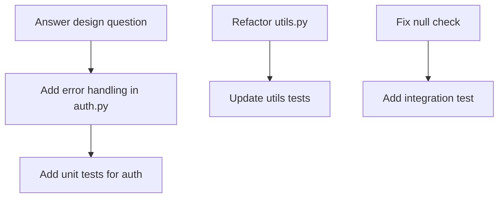

# Phase 2: Planning

Create a structured plan to address all unresolved items identified in Phase 1.

## Objectives

- Group items by type and priority
- Identify dependencies between changes
- Determine execution order (parallel vs. sequential)
- Allocate resources (time, reviewers, agents)
- Define success criteria

## Planning Process

### 1. Group by Type

From Phase 1 research, categorize all items:

```
Code Changes (8 items)
├── Bug fixes (3) - HIGH PRIORITY
├── Refactoring (2) - MEDIUM
├── Style/formatting (3) - LOW
└── Error handling (2) - HIGH

Documentation (4 items)
├── README updates (2) - MEDIUM
└── Inline comments (2) - LOW

Tests (3 items)
├── Unit tests (2) - HIGH
└── Integration tests (1) - MEDIUM

Questions (2 items)
└── Need responses before proceeding
```

### 2. Identify Dependencies

Map dependencies between items:



**Critical path**: G → A → B

### 3. Determine Execution Order

#### Parallel-Safe Changes
Items that can be handled simultaneously:
- Changes in different files
- Independent bug fixes
- Documentation updates in separate sections
- Non-overlapping test additions

#### Sequential Dependencies
Items that must be done in order:
- Question answered → Code change → Test added
- Refactor → Update dependent code → Test
- API change → Update documentation

### 4. Prioritize

Use this priority matrix:

| Priority | Criteria | Action |
|----------|----------|--------|
| **CRITICAL** | Blocks merge, security issue, breaking bug | Do first |
| **HIGH** | Reviewer explicitly requested, affects functionality | Do next |
| **MEDIUM** | Improves code quality, documentation gaps | Do after high |
| **LOW** | Style/formatting, nice-to-haves | Do last or defer |

### 5. Assess Parallel Processing Feasibility

Ask these questions:

```
Can changes be made independently?
├── YES → Candidate for parallel processing
└── NO → Must be sequential

Are there shared files?
├── YES → Check for conflict potential
└── NO → Safe for parallel

Do changes affect same functions/classes?
├── YES → Sequential required
└── NO → Parallel possible
```

## Planning Output

### Implementation Plan Template

```markdown
## PR Comment Resolution Plan - PR #42

### Critical Path (Do First)
1. Answer design question in thread PRRT_abc123
2. Add error handling to auth.py (depends on #1)
3. Add unit tests for auth.py (depends on #2)

### Parallel Batch 1 (After Critical Path)
- Fix null check in user.py (thread PRRT_def456)
- Update README section 3 (thread PRRT_ghi789)
- Add type hints to utils.py (thread PRRT_jkl012)

### Parallel Batch 2 (After Batch 1)
- Add integration test for user flow
- Update API documentation
- Fix formatting in config.py

### Low Priority (Time Permitting)
- Refactor magic numbers to constants
- Add inline comments to complex functions

### Estimated Effort
- Critical Path: 2-3 hours
- Batch 1: 1-2 hours (parallel)
- Batch 2: 1 hour (parallel)
- Low Priority: 30 min
- **Total**: 4-6 hours
```

## Complexity Assessment

Evaluate each item's complexity:

| Complexity | Time Estimate | Risk Level | Test Required |
|------------|---------------|------------|---------------|
| Trivial | < 15 min | Low | Maybe |
| Simple | 15-30 min | Low | Yes |
| Moderate | 30-60 min | Medium | Yes |
| Complex | 1-2 hours | Medium-High | Extensive |
| Very Complex | > 2 hours | High | Extensive + Review |

## Resource Allocation

### For LLM Agents
- Assign parallel batches to separate agent instances
- Sequential items to single agent with context persistence
- Complex items may need human review

### For Human Developers
- Tackle critical path personally
- Delegate parallel batches to team members
- Code review before resolution

### For Automation
- Simple changes → Automated scripts
- Complex changes → Human + agent collaboration
- Tests → Automated generation + human validation

## Risk Mitigation

Identify risks and mitigation strategies:

| Risk | Impact | Mitigation |
|------|--------|------------|
| Breaking change | HIGH | Add comprehensive tests first |
| Merge conflict | MEDIUM | Sync with main branch before changes |
| Missing context | HIGH | Ask clarifying questions first |
| Test failures | MEDIUM | Run tests after each change |
| Incomplete fix | MEDIUM | Verify with reviewer after implementation |

## Decision Points

Document key decisions:

```markdown
### Decision Log

**Decision**: Implement error handling with custom exception class
**Rationale**: Reviewer requested consistent error handling
**Thread**: PRRT_abc123
**Impact**: Affects auth.py, user.py, and utils.py

**Decision**: Defer refactoring to separate PR
**Rationale**: Not blocking, reduces scope
**Thread**: PRRT_xyz789
**Impact**: Mark as "won't fix" in this PR
```

## Next Phase

Once planning is complete, proceed to [[03-implementation]].

## Reference

- [[parallel-workflow]]
- [[sequential-workflow]]

---

[03-implementation]: 03-implementation.md "Phase 3: Implementation"
[parallel-workflow]: ../patterns/parallel-workflow.md "Intra-PR Parallel Workflow"
[sequential-workflow]: ../patterns/sequential-workflow.md "Sequential PR Resolution Workflow"